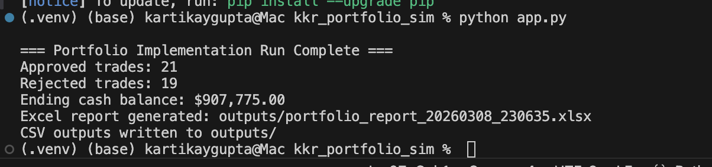

# Leveraged Credit Portfolio Implementation Simulator

A Python-based portfolio implementation and trade compliance simulator for leveraged credit portfolios.

## Features
- Trade sizing and execution readiness checks
- Cash balance forecasting
- Issuer and sector concentration analysis
- Compliance rule engine
- Excel and CSV reporting
- SQLite-backed data storage for reproducibility

## Tech Stack
- Python
- Pandas
- SQLite
- Openpyxl / XlsxWriter

## Run
```bash
python3 -m venv .venv
source .venv/bin/activate
pip install -r requirements.txt
python app.py
```

## Outputs
Approved trades
Rejected trades with breach reasons
Updated holdings
Portfolio summary
Issuer and sector exposure reports


---

# Step 7: how this helps your resume

Resume bullet version:

- Built a **Leveraged Credit Portfolio Implementation Simulator** in **Python, SQL, and Excel**, automating trade sizing, compliance checks, cash forecasting, and portfolio exposure reporting for a mock credit platform.
- Developed rule-based controls for **issuer concentration, sector limits, country eligibility, and cash buffer monitoring**, generating execution-ready trade approval and breach reports.
- Exported portfolio summaries, updated holdings, and analytics to **Excel and CSV**, simulating end-to-end coordination across portfolio management, trading, operations, and technology workflows.

---

# Step 8: best improvements after MVP

After the basic version works, add these in order:

1. **Streamlit dashboard**
   - upload holdings/trades files
   - interactive compliance summary
   - charts for sector and issuer exposure

2. **Trade allocation engine**
   - allocate one trade across multiple portfolios

3. **Liquidity scoring**
   - assign liquidity buckets and flag hard-to-exit positions

4. **Rebalancing module**
   - suggest trades to bring exposures back within limits

5. **SQL queries**
   - store historical runs and compare changes over time

---

# Step 9: exact commands on your Mac

```bash
cd ~/Downloads
mkdir kkr_portfolio_sim
cd kkr_portfolio_sim
mkdir data outputs
```


